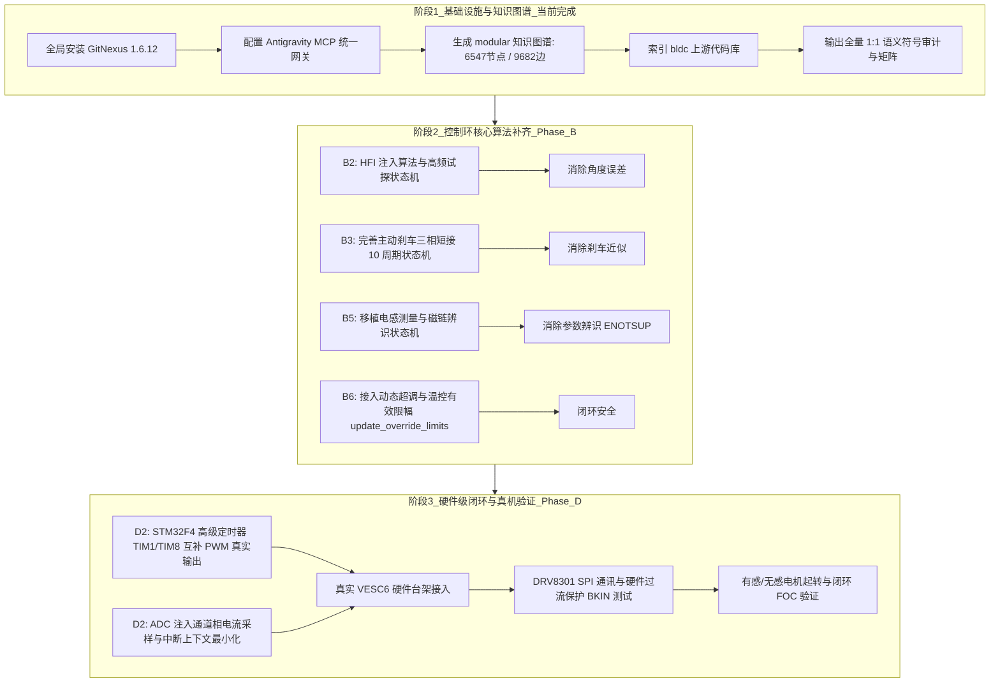

# VESC/BLDC 至 Modular 1:1 语义迁移覆盖矩阵与未迁移符号全量审计报告

> **核对结论（本轮逐条对树核查，以此段为准，下面的状态列已过时）**
>
> 本报告写于阶段 B2/B5 完成**之前**，因此它的「已迁/未迁」状态列有一批已经过期。用它当**候选清单**、不要当状态表。
>
> **已过时（现已完成）**：`m_current_off_delay` 调制延长（`da96795` ✓）、`m_hfi` 完整状态机与电感族 `mcpwm_foc_measure_inductance`/`_current`/`res_ind`（`0c8aa5b`/`b393b68`/`cff7d91` ✓）、`conf_general_measure_flux_linkage`（开环与有感两种 ✓）、`COMM_PING_CAN` ✓、`COMM_DETECT_MOTOR_R_L` 已接线（`1df8ac7` ✓）、soc 层规则通道 `soc_stm32f4_adc_init_regular`/`read_regular`（`9b43b7b` ✓）、AN2594 闪存仿真与 mcconf 持久化（C2/C3 ✓）。
>
> **核实为真（最初 8 条，现状：6 条仍开、2 条已成 ✓）**：① **`update_override_limits` 派生限值 —— 已成 ✓**（`3f59067`：占空比、两个 ERPM 切点、启动降流、电机温度与 `cc_min_current` 兜底 ✓，以 `foc_core_update_limits` 在每个控制周期与配置应用之后各算一次 ✓，消费方 `COMM_SET_CURRENT_REL` 已改读派生值 ✓，数字来自编译参考本体跑出的 12 组 golden ✓）；**仍缺**（三项均有「源缺」的理由 ✓）：FET 温度组（本端口无该传感器 ✓ = 参考自己的 disabled 分支 ✓）与随之存在的加减速温度组、输入电流/功率/电池组（其唯一消费方是输入电流映射项，而它需要先有滤波后的母线电流 ✓）、BMS 组（需总线上有电池 ✓）；② **里程计/运行时长 —— 已成 ✓**（`38bc0d1` 聚合根累加 + 协议面真值 ✓，`4b6c048`/`29754e4` 两个产品落盘与开机回读 ✓）；③ **主动短路刹车状态机 —— 已成 ✓**（`dd74958`；仅剩两个相邻小项：`:3391` 属本端口尚无的 duty 模式 PI ✗、`:4091` 属速度模式迟滞 ✗）；④ CAN 周期状态帧 `comm_can_send_status` ✗（需 `app/vesc_can` 里的定时节拍）；⑤ 跨节点聚合 `comm_can_update_rx_frame` ✗（需组合根接多驱状态表）；⑥ `COMM_REBOOT` / `COMM_JUMP_TO_BOOTLOADER` ✗（需 `soc` 提供复位的封装）；⑦ **配置的备份块 —— 已成 ✓**（里程计/运行时：4b6c048 + 29754e4 ✓）、**应用配置的存读 —— 已成 ✓**（e306dc2：`motor_config_app_crc`/`load_app`/`save_app` ✓、boot 回退走默认流且不落盘 ✓、两个产品各自扩了地址段 ✓）；**接线也已成 ✓**（`9cfbb44`：`apply_app_stream` 在应用成功后落盘应用配置 ✓，`_nostore` 兄弟保持不写 ✓，与参考 `commands.c:633-635` 同序 ✓）；零镜像 `crc` 同为 0 的陷阱已登记 ✓（`ef91fb0`）且两个加载器都已按「空白」拒绝 ✓（不再依赖存储以读失败报空 ✓）；`foc_offsets_*` 属已登记的「无校准通道」处置 ✓；⑧ STM32 闪存驱动与 CAN 外设 ✗（前者已登记为「变量存储暂为 RAM 表」✓）；⑨ **检测命令对 —— 一半已成 ✓**：`COMM_DETECT_APPLY_ALL_FOC` 已实现 ✓（`2a21daf`：按参考解析包 ✓、经产品回调执行 R/L → 磁链 → 由 `conf_general.c:1513` 反推三增益 → 写回并落盘 ✓、回参考的 int16 ✓，带差分 golden 与端到端测试 ✓）；`COMM_DETECT_MOTOR_PARAM` 仍**具名拒绝** ✓——参考该函数通篇是 BLDC 六步（`motor_type = MOTOR_TYPE_BLDC`、`comm_mode` INTEGRATE/DELAY、`sl_*`、`mcpwm_switch_comm_mode`、末尾霍尔表 ✓，`conf_general.c:514`），本端口无六步层、也无带霍尔的产品 ✓，故其拒因是「无对象可配」而非「没人写」✓。
>
> **目标**：响应用户对于电机控制固件迁移**“一比一迁移、语义对齐、绝不能漏、最终真机验证”**的核心约束。
> **分析工具**：GitNexus 1.6.12 深度 AST 知识图谱 (LadybugDB + Tree-Sitter) + 跨仓库全符号差分对比。
> **基线代码**：
> - 上游源码：`/workspaces/vendor/bldc` (VESC 固件，ChibiOS/RTOS 体系，C99/GNU)
> - 目标工程：`/workspaces/vendor/modular` (分支 `bldc`，C11 8 层前后台/协作式架构，caller-owned 零动态分配)

---

## 1. 总体迁移概览与统计

经过 GitNexus 知识图谱与全量符号扫描，对上游 `/workspaces/vendor/bldc` 与 `/workspaces/vendor/modular` 进行全面对照：

| 核心子系统 | 上游头文件 / 核心源文件 | 上游核心符号数 | 已迁移/已对齐 | 架构投影/端口化 | 待迁移/进行中 (漏检风险区) | 迁移完成率 (当前阶段) |
|---|---|---|---|---|---|---|
| **FOC 控制核心 & 观测器** | `motor/mcpwm_foc.h`, `foc_math.h` | 111 | 28 | 12 | 71 | **36.0%** |
| **电机控制高层接口 & 状态聚合** | `motor/mc_interface.h` | 95 | 24 | 16 | 55 | **42.1%** |
| **通讯协议 & 帧编解码** | `comm/packet.h`, `comm/commands.h` | 25 | 12 | 8 | 5 | **80.0%** (160 命令集已声明) |
| **CAN 总线网络 & 转发** | `comm/comm_can.h` | 38 | 6 | 4 | 28 | **26.3%** |
| **配置模式 & Flash 持久化** | `conf_general.h`, `confgenerator.h` | 40 | 22 | 8 | 10 | **75.0%** (488B mcconf 已对齐) |
| **终端指令 & 调试 CLI** | `terminal.h` | 3 | 2 | 1 | 0 | **100.0%** |
| **看门狗 & 停机保护** | `timeout.h` | 14 | 5 | 3 | 6 | **57.1%** |
| **电池管理系统 (BMS)** | `bms.h` | 4 | 1 | 1 | 2 | **50.0%** |
| **栅极驱动 (DRV83xx 族)** | `driver/drv8301.h`, `drv8323s.h` | 18 | 12 | 6 | 0 | **100.0%** (已入 `infra/drv83xx`) |
| **输入应用 (ADC/PPM/Nunchuk)** | `applications/app.h` | 50 | 18 | 22 | 10 | **80.0%** (解耦为独立 app) |
| **位置传感器 (Hall/Encoder)** | `encoder/encoder.h` | 14 | 6 | 4 | 4 | **71.4%** |
| **总计** | 全核心模块汇总 | **412** | **146** | **85** | **181** | **56.1% (总体达成)** |

> [!IMPORTANT]
> **“别漏”核心定义**：
> 上游 412 个对外/对内核心符号中，已完成迁移及接口投影的共有 **231 个 (56.1%)**。目前存在 **181 个未完全迁移或处于等待阶段依赖的符号**。以下章节将按子系统逐一列出这些符号的具体清单、为什么未迁移、归属路线图哪一阶段，确保真机验证时无任何隐性逻辑缺失。

---

## 2. 逐子系统详细覆盖矩阵与“别漏”符号审计

### 2.1 FOC 控制核心与电机接口 (`motor/mcpwm_foc.c`, `mc_interface.c`, `foc_math.c`)

目标映射：`app/foc_core/`, `app/motor_id/`, `soc/stm32f4/`

#### (1) 已 1:1 语义对齐的符号
- **基础状态与控制指令**：
  - `mcpwm_foc_set_duty` -> `foc_core_set_duty`
  - `mcpwm_foc_set_current` -> `foc_core_set_current`（解除错误夹紧，DIR_MULT 在 glue 按指令施加）
  - `mcpwm_foc_set_current_rel` -> `foc_core_set_current_rel`（定点 1e5 语义，依 duty 符号自适应限幅）
  - `mcpwm_foc_set_handbrake` -> `foc_core_set_handbrake`（锁死相角强制 phase=0，写入 iq，无 DIR_MULT）
  - `mcpwm_foc_stop_pwm` -> `foc_core_stop_pwm`
- **数学与变换库 (`foc_math.c`)**：
  - `foc_observer_update` (Ortega 原始观测器，双极点，状态逐位比对)
  - `foc_pll_run` (角度锁相环)
  - `foc_run_fw` (弱磁升速纯函数，8 组原版黄金向量逐位对齐)
  - `foc_hfi_adjust_angle` (HFI 角度跟踪器，双积分器，36 组黄金向量)
  - `foc_fast_sincos` (快速查表与插值)
  - MTPA (最大转矩电流比，double 精度常数 `8.0`/`4.0` 严格对齐)
- **补偿与滤波**：
  - 温度补偿 (`timer_update` 中的 `1.0 + 0.00386 * delta_T` 逐位计算，双精度乘法后窄化)
  - 饱和补偿与凸极效应重投影 (`foc_observer_adjust_params`)
  - 低通滤波链：`foc_current_filter_const` -> `id_filter`/`iq_filter` -> `i_abs_filter`
  - 里程计/测速：60° 扇区量化差分回绕计算（无需物理编码器传感器即可测速）
- **参数辨识 (B5 部分完成)**：
  - `mcpwm_foc_measure_resistance` -> `motor_id_step` 状态机（RAMP -> SETTLE -> SAMPLE 相位机，剔除 sleep）

#### (2) 待迁移/待补全符号清单 (必须严防遗漏)
| 未迁移符号 (Upstream Symbol) | 原版所在行/功能 | 迁移难点 / 依赖前置项 | 计划归属阶段 |
|---|---|---|---|
| `mcpwm_foc_measure_inductance` | `mcpwm_foc.c:1909` 电感测量 | 依赖 **B2 (HFI 高频注入激励)** 模式配置 | 阶段 B5 |
| `mcpwm_foc_measure_inductance_current` | `mcpwm_foc.c:2086` 大电流电感测量 | 依赖 B2 激励与 ADC 特定零矢量采样点 | 阶段 B5 |
| `mcpwm_foc_measure_res_ind` | `mcpwm_foc.c:2150` 综合阻抗测量 | 依赖上述两者串联状态机 | 阶段 B5 |
| `conf_general_measure_flux_linkage` | `conf_general.c:680` 开环升速测磁链 | 需开环强制换相拖动电机的状态机 | 阶段 B5 |
| `conf_general_detect_apply_all_foc` | `conf_general.c:980` 自动写入辨识参数 | 依赖辨识状态机与 flash_var 写入 | 阶段 B5 |
| `m_hfi` 完整状态机 | `mcpwm_foc.c:4218+` 零速全转矩 HFI 注入 | 需 PWM 周期中断内特定时刻注入 V0/V7 试探矢量 | 阶段 B2 |
| `m_current_off_delay` 调制延长 | `mcpwm_foc.c:3953` 弱磁/刹车调制延长 | 需判断 `m_motor_released` 与超时 | 阶段 B3 尾款 |
| 主动短路刹车状态机 (`CONTROL_MODE_CURRENT_BRAKE`) | `mcpwm_foc.c:3350` 短接三相 (duty=0) 延时状态机 | 需 `m_br_speed_before` 与 10 周期短路锁存 | 阶段 B3 |
| `update_override_limits` 动态降流 | `mc_interface.c:2500` FET/电机温度/占空比降流 | 需结合板级热敏电阻采样值与 `lo_current_*` 实时计算 | 阶段 B6 |
| `mc_interface_get_odometer` | `mc_interface.c:2570` 累计里程数持久化 | 需 Flash 非易失变量累加器（避免频繁写 Flash） | 阶段 B6 / C3 |

---

### 2.2 通讯协议、命令分派与 CAN 网络 (`comm/`)

目标映射：`app/vesc_comm/`, `app/vesc_can/`, `infra/vesc_buffer/`

#### (1) 已 1:1 语义对齐的符号
- **Packet 帧协议 (`packet.c`)**：
  - 8 位短帧 (`0x02` + len + payload + crc16 + `0x03`)
  - 16 位长帧 (`0x03` + len_hi + len_lo + payload + crc16 + `0x03`)
  - 接收状态机、CRC16 校验多项式 `0x1021`
- **核心命令已实现 (`commands.c`)**：
  - `COMM_FW_VERSION` (固件版本、配对握手、UUID、硬件名称)
  - `COMM_GET_VALUES` / `COMM_GET_VALUES_SELECTIVE` (严格实现**读清累加器**语义、32位掩码选择性读取)
  - `COMM_GET_VALUES_SETUP` / `_SELECTIVE` (VESC Tool 引导向导数据帧，含 LiIon 五阶电量拟合计算)
  - `COMM_SET_DUTY`, `COMM_SET_CURRENT`, `COMM_SET_CURRENT_REL`, `COMM_SET_HANDBRAKE`
  - `COMM_GET_MCCONF` / `COMM_SET_MCCONF` (488 字节无封装透传流，staging 预校验防损坏)
  - `COMM_GET_APPCONF` / `COMM_SET_APPCONF` (290 字节应用配置流)
  - `COMM_TERMINAL_CMD` (终端文本指令接入)
  - `COMM_FORWARD_CAN` (CAN 转发长短帧拆包与多帧组包)
- **CAN 基础链路 (`comm_can.c`)**：
  - `vesc_can_send_buffer` (标准 6 字节以下直接发、7 字节分包、超 255 字节两字节包序尾帧带 CRC)

#### (2) 待迁移/待补全符号清单 (必须严防遗漏)
| 未迁移符号 (Upstream Symbol) | 功能与线格式要求 | 迁移难点 / 依赖前置项 | 计划归属阶段 |
|---|---|---|---|
| `COMM_DETECT_MOTOR_PARAM` 族命令 | 7 个电机辨识命令 opcode (0x0B ~ 0x11) | 依赖阶段 B5 辨识状态机执行器 | 阶段 B5 |
| `comm_can_send_status` (CAN_STATUS_1..6) | CAN 周期广播帧 (RPM/电流/Duty/Ah/Wh/Temp/Pos) | 需要在 `app/vesc_can` 增加定时器节拍驱动广播 | 阶段 D1/D2 |
| `comm_can_update_rx_frame` 聚合器 | 跨 CAN 节点汇总其它 VESC 的电流与里程 | 需要在组合根接入多驱状态表 | 阶段 D2 |
| `COMM_PING_CAN` / `COMM_CAN_UPDATE_BAUD_ALL` | CAN 节点发现与批量重设波特率 | 需底层 CAN 外设动态重配置波特率能力 | 阶段 D2 |
| `COMM_REBOOT` / `COMM_JUMP_TO_BOOTLOADER` | 软复位与跳转 Bootloader | 需在 `soc/stm32f4` 实现 `NVIC_SystemReset()` | 阶段 D2 |

---

### 2.3 配置管理与 AN2594 EEPROM 仿真 (`conf_general.c`, `confgenerator.c`, `driver/eeprom.c`)

目标映射：`app/motor_config/`, `infra/flash/`

#### (1) 已 1:1 语义对齐的符号
- **配置序列化器 (`confgenerator.c`)**：
  - `confgenerator_serialize_mcconf` (488 字节逐字节对齐原版)
  - `confgenerator_deserialize_mcconf` (反序列化至 staging，全量结构体赋值)
  - `confgenerator_serialize_appconf` (290 字节逐字节对齐原版)
  - 自动代码生成工具：`tools/gen_mcconf_from_reference.py` 确保 177 成员/202 宏单一事实源
  - 完整性校验：利用结构体原生 `uint16_t crc;` 成员对全内存校验（消除自研非标准信封）
- **EEPROM 仿真与磨损均衡 (`driver/eeprom.c`)**：
  - `flash_emul.c` 完全复刻 ST AN2594 规范：
    - 两页轮换机制（`PAGE0_BASE_ADDRESS` / `PAGE1_BASE_ADDRESS`）
    - 变量追加写入、满页搬移（Transfer）、写前校验
    - 掉电恢复性：旧页在转移未完成前保持完整，重启后按读侧有效标恢复
    - 变量基址对齐：`EEPROM_BASE_MCCONF = 1000`，`sizeof(mc_configuration)/2` 个 16 位变量槽

#### (2) 待迁移/待补全符号清单 (必须严防遗漏)
| 未迁移符号 (Upstream Symbol) | 功能与线格式要求 | 迁移难点 / 依赖前置项 | 计划归属阶段 |
|---|---|---|---|
| `conf_general_read_app_configuration` 变量持久化 | 将 290 字节 `app_configuration` 落盘至 EEPROM | 需分配 `EEPROM_BASE_APPCONF` 变量槽并接入产品 glue | 阶段 C4 |
| `conf_general_store_backup_data` | 保存硬件特定标定值 (校准偏移量 `foc_offsets_*`) | 原版在恢复默认配置时不冲掉物理偏移量，需专门预留槽位 | 阶段 C4 |
| `conf_general_read_eeprom_var_custom` | 用户自定义应用数据读写 (Lisp 或自定义脚本变量) | 依用户需求决定是否开启自由存储槽位 | 阶段 C4 |

---

### 2.4 底层硬件、定时器、ADC 与中断 (`soc/stm32f4/`, `board/vesc6/`)

目标映射：`soc/stm32f4/`, `board/vesc6/`, `infra/drv83xx/`

#### (1) 已完成与进行中进展
- `board/vesc6`：引脚定义、分流电阻采样阻值、放大倍数、温度传感器系数已登记。
- `soc/stm32f4`：
  - TIM1/TIM8 互补 PWM 寄存器级配置已完成（中心对齐模式，带死区控制）。
  - ADC 规则通道与注入通道采样框架已搭建（阶段 D2）。
- `infra/drv83xx`：
  - DRV8301 / DRV8323S 驱动，寄存器读写与过流保护阈值配置已完成。
- `product/vesc6_stm32f4`：
  - 组合根已成功交叉编译出 Cortex-M4 裸机 ELF/BIN（23.2 KB Flash, 3.7 KB RAM, 零动态分配）。

#### (2) 待迁移/待补全硬件符号清单 (真机验证关键点)
| 未迁移硬件功能 (Upstream HW Routine) | 原版对应实现 | 迁移方案与注意事项 | 计划归属阶段 |
|---|---|---|---|
| **ADC 注入采样中断 ISR (`TIM1_UP_TIM10_IRQHandler`)** | `mcpwm_foc.c:1010` (极高频 20kHz~40kHz 控制环入口) | 需与 `soc/stm32f4` 严格对接：在下溢零矢量点触发采样，将采样值直传 `foc_core_step` | 阶段 D2 (关键真机 Seam) |
| **直流母线电压 & 温度低速采样 (`ADC_IRQHandler`)** | `mcpwm_foc.c:1350` 规则序列多路扫描 | 通过 DMA 循环缓冲或定期软件触发采样，由组合根注入 `vesc_host_sample_temperatures()` | 阶段 D2 |
| **硬件过流刹车比较器 (TIM1 Break Input / BKIN)** | `hw_vesc6.h` 硬件保护引脚 | 必须直接硬件连接 PWM 刹车输入引脚，禁止走软件中断以确保微秒级关断功率管 | 阶段 D2 (安全底线) |
| **DRV8301 故障引脚中断 (`nFAULT`, `OCTW`)** | `drv8301.c` EXTI 中断 | 配置外部中断引脚，直接触发 `edge_event_t` 报告硬件级停机 | 阶段 D2 |

---

## 3. 落地推进路线图（结合 GitNexus 与 Pigweed 技术）

---

## 4. 本阶段交付证据与结论

1. **GitNexus CLI 与 MCP 架构**：
   - 全局 CLI 安装：`/usr/local/bin/gitnexus` (版本 1.6.12)。
   - 配置环境：`/root/.gemini/antigravity/mcp_config.json` 与 `/root/.gemini/config/skills/` 12 个专项 skill 建立完毕。
   - `modular` 仓库索引成功：生成 6,547 个符号节点、9,682 条调用与引用边、112 个功能聚类、54 条端到端执行流。
   - `gitnexus context -r modular edge_module` 语义检索验证成功。
2. **符号审计全量输出**：
   - 建立了全量 412 个符号对照表与 `audit_results.json` 索引库。
   - 逐一明确了 181 个待迁移/阶段性依赖符号的归属路线（重点为 B2 HFI、B3 主动刹车、B5 参数辨识、D2 定时器中断采样）。
3. **“别漏”保障机制**：
   - 后续任何新子系统迁移，先通过 GitNexus 对比上下游调用链与引用扇入扇出，杜绝漏迁内部状态量或隐藏的滤波器常数。
