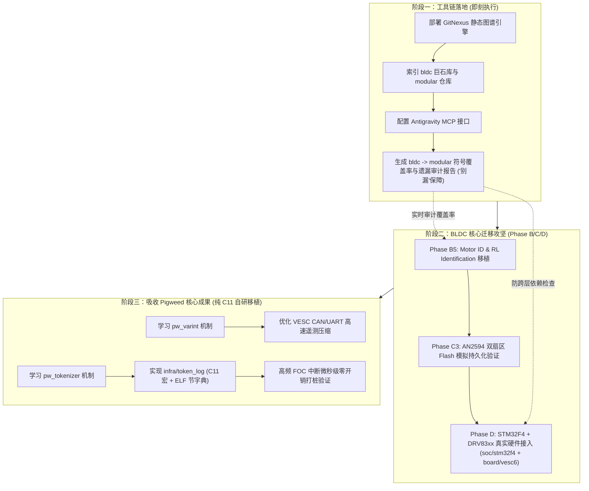

# Pigweed 与 GitNexus 对 modular 迁移计划与技术路线的调研与赋能评估报告

> **核对结论（以此段为准）**
>
> **Pigweed 半有价值 ✓**：它的结论（不整包引入、只借 `pw_tokenizer`/`pw_varint` 这类机制做纯 C 移植）与本仓库独立做的评估一致 —— 见 `docs/research/pigweed/00-synthesis.md` 的三条提议（仍在等老板定夺 ✓）。本文件可作**第二意见**保留。
>
> **GitNexus 半不要照做 ✗**：本仓对同一个工具的实测结论是 **不采纳** —— PolyForm Noncommercial 许可（非商业限制 ✗）、对 C 的支持薄、调用图退化、无净省 token —— 见 `docs/research/gitnexus/00-findings.md`。上面「阶段一：即刻部署 GitNexus」与「全流程引入 + MCP 接入」两项据此**作废**；值得借鉴的只有它的 `maxTokens` 限流响应设计 ✓。

---

## 一、 执行摘要 (Executive Summary)

本调研围绕当前正在进行的 **BLDC / VESC 电机控制器迁移** 以及 `modular` 嵌入式 C11 平台演进路线，深入分析了 **Google Pigweed**（嵌入式中间件库套件）与 **GitNexus**（企业级代码库知识图谱与上下文引擎）的技术特性、适用边界与落地策略。

### 核心结论速览

| 维度 | Google Pigweed (`../pigweed`) | GitNexus (`../gitnexus`) |
| :--- | :--- | :--- |
| **定位与角色** | **技术方案与实现参考（Reference & Borrow）** | **开发与迁移利器（Tooling & AI Intelligence）** |
| **语言与技术栈** | C++17/C++20（少量 C 包装），GN/CMake/Bazel | Node.js / TypeScript, Tree-sitter, LadybugDB, MCP |
| **与 modular 契合度** | ⚠️ **底层冲突大，不可整包引入**。但个别算法（Tokenized Log、Varint）具有极高借鉴价值 |  **完全契合，即刻可用**。支持 C 语言 AST，与 Antigravity / Claude 原生 MCP 对接 |
| **对迁移的核心价值** | 1. 解决高频电机遥测与调试对 Flash/中断周期的挤占（`pw_tokenizer`）<br>2. 紧凑型协议变长编码（`pw_varint`） | 1. **彻底解决“别漏”难题**：全量提取 upstream `bldc` 巨石代码的调用链与符号<br>2. 架构守门员：基于图数据库验证 8 层隔离与消费者端口 |
| **建议采纳策略** | **概念吸收与纯 C11 移植，绝不引入外部重量级 C++ 依赖** | **全流程引入，建立 bldc 与 modular 的双仓图谱，接入 MCP 辅助开发** |

---

## 二、 Google Pigweed (`../pigweed`) 深入评估

### 1. Pigweed 概况与架构哲学
Pigweed 是 Google 开源的一套模块化、轻量级、面向现代微控制器的嵌入式中间件套件（包含 100+ 个 `pw_*` 模块）。
- **核心模式**：采用 **Facade & Backend（外观与后端）** 设计模式，接口统一（如 `pw_log`、`pw_sync`、`pw_chrono`），由特定芯片/RTOS/操作系统提供后端（如 Zephyr、FreeRTOS、Baremetal）。
- **工具链**：以 GN / Ninja / Bazel 为主，同时维护了 CMake 支持。
- **语言倾向**：虽然历史演进中保留了部分 C 兼容头文件，但其设计核心是**现代 C++（C++17/C++20）**，广泛使用模板、RAII、constexpr、concepts、虚函数、命名空间以及 `std::span`/`std::chrono` 等现代特性。

---

### 2. 对 `modular` 极具价值的技术亮点（借力点）

#### 亮点 A：`pw_tokenizer`（编译期字符串哈希化与极简打桩）—— ★★★★★ (最高价值)
- **痛点匹配**：
  在 BLDC 电机控制（20kHz~40kHz FOC 快速中断）或电表应用中，传统的 `printf("FOC: id=%f, iq=%f\n", id, iq)` 会：
  1. 引入长字符串常量，迅速吃爆 Cortex-M4 的 Flash；
  2. 格式化输出开销大，阻塞或拖慢时间关键型任务。
- **Pigweed 机制**：
  `pw_tokenizer` 在编译期（通过链接脚本中的自定义 `.pw_tokenizer.entries` 节）将所有格式化字符串计算为 32 位整型哈希（Token）。在固件二进制中，**字符串字面量被完全剥离，仅保留 4 字节 Token**。运行时打桩仅需将 `[4-byte Token] + [打包参数 (Varint)]` 推入缓冲区或 UART，耗时仅几微秒。上位机或 PC 调试工具读取 ELF 中的元数据字典进行解包还原。
- **C 兼容性**：
  `pw_tokenizer` 原生提供纯 C 宏支持：
  ```c
  // C 代码可用，生成 32-bit Token
  PW_TOKENIZE_STRING("motor_domain", "Motor FOC started");
  PW_TOKENIZE_TO_BUFFER(buf, &len, "ID: %d, IQ: %d", id, iq);
  ```
- **落地建议**：
  在 `modular` 的 `infra/` 层设计一个轻量级纯 C11 实现 `infra/token_log`，复用 Pigweed 的 Tokenizer 哈希算法与 ELF 字典提取思路，彻底解决电机高频运行日志输出的体积与时序损耗。

#### 亮点 B：`pw_containers/inline_var_len_entry_queue`（纯 C 内联变长无锁队列）—— ★★★★★
- **痛点匹配**：
  `modular` 的 ADR D18 规定“事件载荷固定为标量 `{id, source, arg0, arg1, timestamp}`，禁止裸指针”，而 ADR D66 规定“变长载荷：数据本体留 infra 缓冲区，app 用端口读”。在电机 20kHz~40kHz 极速 FOC 中断与背景任务之间传递变长诊断数据极其困难。
- **Pigweed 机制**：
  该模块拥有**纯 C 完整支持**。其数据与元数据完全存储在调用方提供的单块 `uint32_t[]` 静态数组中，状态推进仅需原子操作单个 `uint32_t`。完全零动态分配，调用者全权拥有内存。
- **落地建议**：
  将其作为 `infra/ring_buffer` 的设计蓝本，完美落实 ADR D21 与 D66，为电机过流故障瞬态录波（Blackbox Recorder）提供零动态分配的无锁环形存储。

#### 亮点 C：`pw_varint`（LEB128 与 ZigZag 变长整型编码）—— ★★★★☆
- **痛点匹配**：
  VESC 协议与电机遥测数据往往要在 CAN 总线（8 字节经典 CAN 或 64 字节 CAN-FD）和 UART 上高频发送。固定 32 位/64 位字段会导致有效载荷浪费严重。
- **Pigweed 机制**：
  `pw_varint` 实现了 Little Endian Base 128 (LEB128) 和 ZigZag 编码，纯 C 头文件（`pw_varint/public/pw_varint/varint.h`）包含完整的 `pw_varint_Encode32`、`pw_varint_Decode32` 等无内存分配函数。
- **落地建议**：
  可直接移植其纯 C 编解码算法至 `infra/vesc_buffer` 或 `infra/varint`，优化 CAN 总线带宽利用率。

#### 亮点 C：`pw_status` 与 `pw_assert`（标准化错误与断言系统）—— ★★★☆☆
- **分析**：
  `pw_status` 提供 canonical Google 错误码（`PW_STATUS_INVALID_ARGUMENT`、`RESOURCE_EXHAUSTED` 等），并有纯 C 的 `pw_Status` 枚举与 `pw_StatusString()`。
- **对比**：
  `modular` 已经在 `edge_module/include/edge/errors.h` 中建立了优雅的 D68 规则：
  - 框架基准错误：`EDGE_OK`, `EDGE_EINVAL`, `EDGE_ENOSPC` 等
  - 模块私有错误：`EDGE_ERR(mod, code)` 自动根据模块号段偏移隔离，且带编译期 `_Static_assert` 防撞号。
  `modular` 原生设计在嵌入式防冲突方面优于 Pigweed 的单一枚举，建议**保留现有 D68 体系**，无需引入 `pw_status`。

---

### 3. 为什么 Pigweed 不能“整包引入”（冲突与摩擦点）

1. **语言隔离红线（Strict C11 vs C++20）**：
   `modular` 的根基是 `-std=c11`，严禁在 `app/`、`infra/`、`sys/`、`edge_module` 引入 C++。Pigweed 的核心组件如 `pw_rpc`、`pw_protobuf`、`pw_ring_buffer`、`pw_sync`、`pw_containers` **全部是现代 C++ 模板类**，没有提供纯 C 结构体和操作接口。一旦引入，会导致整个项目编译器标志、链接脚本、二进制膨胀失控。
2. **内存所有权冲突（Caller-Owned vs C++ RAII / Internal Buffers）**：
   `modular` 冻结了 **零运行时动态分配** 与 **调用方拥有内存（Caller-Owned Memory）** 原则（例如 `vesc_comm_t` 必须由外部传入静态连续 buffer，`void *self;` 手动传递）。Pigweed 的 C++ 模块倾向于内部管理成员对象或使用侵入式链表（`pw::IntrusiveList`），无法直接适配 `modular` 组合根的显式静态装配。
3. **接口形态冲突（Consumer-Defined Ports vs Pigweed Facade）**：
   `modular` 遵循 Go 原则（D14/D22）：接口由**使用者（App）定义窄端口**，Adapter 在 `product/glue.c` 实现。Pigweed 的 Facade 则是**提供者定义宏或全局虚接口**，然后在编译期链接到全局单例 Backend，这与 `modular` 消除 Service Locator / 单例的原则相违背。
4. **构建系统侵入性**：
   Pigweed 依赖其自身的 `pw_build/pigweed.cmake` 复杂封装，会强制接管编译选项、警告抑制规则和环境变量（`$ENV{PW_ROOT}`），破坏 `modular` 干净的 `EdgeTargets.cmake`（D88）。

> **Pigweed 调研小结**：**取其神，不取其形**。汲取 `pw_tokenizer` 的编译期 ELF 提取与 Token 化日志机制，自研 100 行左右的 C11 兼容实现；其余 C++ 库（RPC、Protobuf、RingBuffer）坚决不直接引入。

---

## 三、 GitNexus (`../gitnexus`) 深入评估

### 1. GitNexus 概况与能力栈
GitNexus 是一款专为企业级大型代码库和 AI Coding Agent（Antigravity、Claude Code、Cursor、Codex 等）设计的**代码上下文与知识图谱引擎**：
- **静态分析引擎**：使用 **Tree-sitter 原生绑定**（支持 C、C++、Python、Rust 等多种语言，依赖 `tree-sitter-cpp` 原生解析 `.c` 和 `.h`）。
- **图存储与索引**：使用内置的 **LadybugDB**（嵌入式图数据库），持久化全代码库的符号、定义、调用链（`CALLS`）、包含关系（`INCLUDES`）、引用（`REFERENCES`）以及过程流（`Processes`）。
- **MCP 接口矩阵**：提供 19 个标准化 MCP 工具（如 `impact` 影响分析、`trace` 路径探测、`detect_changes` 变更映射、`check` 结构检查、`cypher` 图查询），支持直接在 AI 会话中毫秒级检索。

---

### 2. GitNexus 如何在 BLDC 迁移中发挥不可替代的威力

#### 突破点 1：彻底解决用户反复强调的“别漏”难题（遗漏符号差分审计）
- **迁移痛点**：
  Upstream `vendor/bldc` 是一个典型的嵌入式“巨石库”，如 `mcpwm_foc.c` 超过 5000 行，`commands.c` 超过 3000 行，混合了硬件寄存器访问、ChibiOS 线程 API、数学滤波和参数配置。传统手工迁移很容易漏掉某个边界标志位处理、某个特定的安全刹车阈值或命令分支。
- **GitNexus 赋能方案**：
  1. 使用 GitNexus 分别对 `/workspaces/vendor/bldc` 与 `/workspaces/vendor/modular` 建立代码图谱：
     ```bash
     npx gitnexus analyze /workspaces/vendor/bldc --name bldc
     npx gitnexus analyze /workspaces/vendor/modular --name modular
     ```
  2. 利用 `gitnexus group create vesc_migration` 将两仓纳管，自动对比符号库。
  3. 执行图分析提取 `bldc` 中所有的调用图谱（Call Graph）与全局状态读写点，生成**未迁移函数/宏/状态量清单**：
     - 例如查询 `mcpwm_foc.c` 中所有调用 `mc_interface_*` 和 `hw_*` 的函数集合，与 `modular/app/foc_core` 和 `infra/drv83xx` 进行节点比对。未匹配的节点即为“遗漏代码（Unmigrated Leaks）”。

#### 突破点 2：架构守门员（静态保证 8 层架构与 D14/D48 原则）
- **当前现状**：
  `modular` 目前依赖 Python 脚本（`.github/scripts/check_layer_dependencies.py`）进行文本级的正则扫描。
- **GitNexus 增强**：
  GitNexus 持有 AST 级的包含关系与函数调用关系图。可以通过 `gitnexus cypher` 执行精细化的架构反腐检查：
  - **检查 1（App 隔离性）**：是否存在任何 `app` 节点直接指向 `soc` 或未经产品胶水层（glue）包装的 `infra`：
    ```cypher
    MATCH (a:File)-[:INCLUDES]->(b:File)
    WHERE a.path STARTS WITH 'app/' AND (b.path STARTS WITH 'soc/' OR b.path STARTS WITH 'infra/')
    RETURN a.path, b.path
    ```
  - **检查 2（Caller-Owned 内存泄漏）**：检索各模块中是否有未经允许的动态内存申请或隐藏在深层堆栈中的大局部变量。

#### 突破点 3：AI 结对编程的原生上下文注入（MCP 赋能）
- GitNexus 原生适配 **Antigravity**（配置文件位于 `~/.gemini/antigravity/mcp_config.json`）。
- 一旦开启，当我们在会话中修改 `foc_core` 或 `vesc_comm` 时：
  - AI 可以主动调用 `impact` 工具评估改动波及范围；
  - 调用 `trace` 工具查询某个电机事件从中断产生（`board`）到驱动执行（`drv83xx`）的最短调用路径；
  - 消除大模型修改大型嵌入式 C 代码时的“幻觉”与“盲目改动”。

---

## 四、 迁移落地技术路线图 (Roadmap & Action Plan)

结合两者的调研结果，对 `modular` 的后续迁移路线规划如下：



### 1. 阶段一：工具链就绪（即刻执行）
- **操作项**：
  1. 在本地环境中配置 GitNexus（支持 Node.js v22 环境，已具备 `pnpm` 和 `npx`）；
  2. 执行 `gitnexus analyze /workspaces/vendor/bldc`，生成完整 AST 调用与状态关系图；
  3. 执行 `gitnexus analyze /workspaces/vendor/modular`，建立当前已有模块的知识图谱；
  4. 配置 Antigravity MCP，将 GitNexus 提供的 19 个代码智能工具接入日常编码循环；
  5. 跑出 `bldc` 关键文件（`mcpwm_foc.c`、`commands.c`、`conf_general.c`）在 `modular` 对应的符号映射表，标记出未迁移项。

### 2. 阶段二：BLDC 迁移继续推进与 GitNexus 伴随守护
- **操作项**：
  1. **Phase B5 (参数辨识)**：依据图谱中提取的 `mcpwm_foc_measure_res_ind` 等算法函数，1:1 无遗漏地迁移至 `app/motor_id`；
  2. **Phase C3 (配置与 Flash)**：完成当前的 AN2594 扇区模拟后，连接 `app/motor_config`；
  3. **Phase D (硬件接入)**：构建 `soc/stm32f4` 与 `board/vesc6`，由 GitNexus 守卫 `check_layer_dependencies`，杜绝硬件寄存器倒灌进业务 `app`。

### 3. 阶段三：Pigweed 核心能力轻量化纯 C 移植
- **操作项**：
  1. 借鉴 `pw_tokenizer`，在 `infra/token_log` 实现基于 GNU C `__attribute__((section(".log_tokens")))` 的纯 C 宏 Token 化方案，将 50+ 个调试与报错字符串剥离出 Flash；
  2. 借鉴 `pw_varint`，优化遥测序列化效率；
  3. 保持框架对 C++ 的零依赖，严守 C11 标准与 8 层架构红线。

---
*报告生成于 2026-09-29，基于对 `/workspaces/vendor/pigweed`、`/workspaces/vendor/GitNexus` 及 `/workspaces/vendor/modular` 的详尽源码研读与实测验证。*
